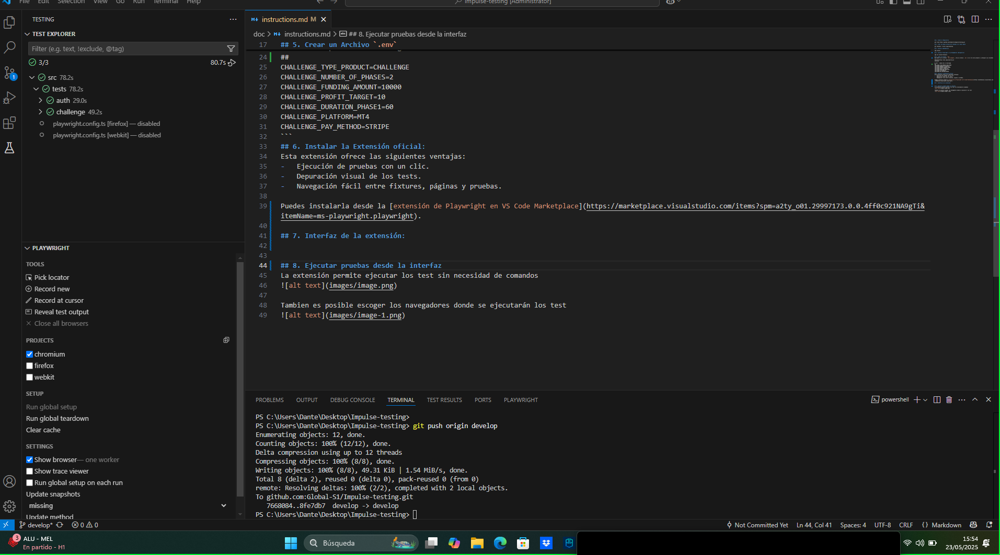
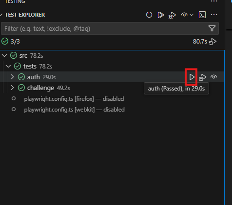
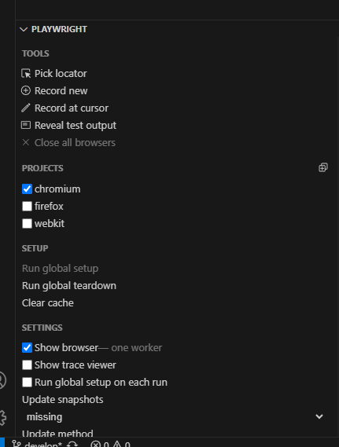

## 1. Clonar el Repositorio
```
git clone https://github.com/Global-S1/Impulse-testing.git
```
## 2. Crear una Rama de Desarrollo basada en la rama remota
```
git checkout --track origin/develop
```
## 3. Instalar Dependencias
```
npm install
```
## 4. Instalar Playwright y los Navegadores (Obligatorio)
```
npm run install-browsers
```
## 5. Crear un Archivo `.env`
Basándote en el archivo `.env.example`, crea un archivo `.env` en la raíz del proyecto y configura las variables necesarias. 
```
BASE_URL=https://dev.impulseworld.pro
CI=false

# test - compra de un challenge
## Caracteristicas requeridas para adquirir un challenge
CHALLENGE_TYPE_PRODUCT=CHALLENGE
CHALLENGE_NUMBER_OF_PHASES=2
CHALLENGE_FUNDING_AMOUNT=10000
CHALLENGE_PROFIT_TARGET=10
CHALLENGE_DURATION_PHASE1=60
CHALLENGE_PLATFORM=MT4
CHALLENGE_PAY_METHOD=STRIPE
```
## 6. Instalar la Extensión oficial:
Esta extensión ofrece las siguientes ventajas:
-   Ejecución de pruebas con un clic.
-   Depuración visual de los tests.
-   Navegación fácil entre fixtures, páginas y pruebas.

Puedes instalarla desde la [extensión de Playwright en VS Code Marketplace](https://marketplace.visualstudio.com/items?spm=a2ty_o01.29997173.0.0.4ff0c921NA9gTi&itemName=ms-playwright.playwright).

## 7. Interfaz de la extensión:


## 8. Ejecutar pruebas desde la interfaz
La extensión permite ejecutar los test sin necesidad de comandos


Tambien es posible escoger los navegadores donde se ejecutarán los test
